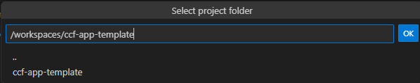
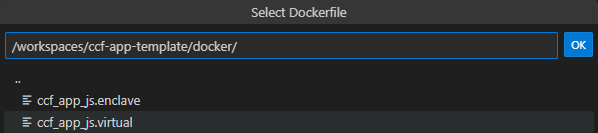
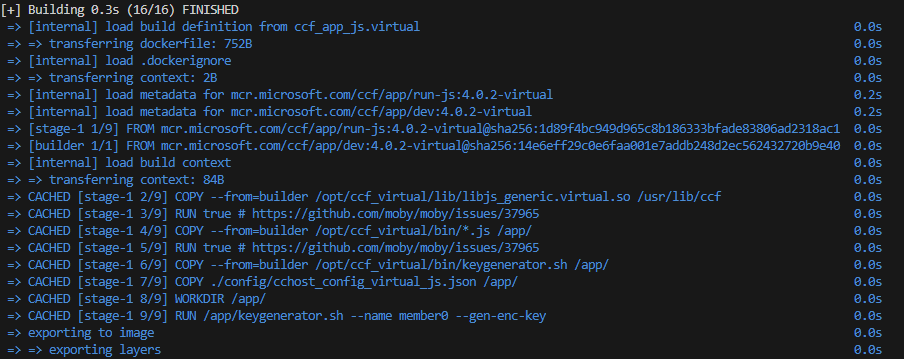

<<<<<<< HEAD
# vscode-azure-managed-ccf README

This is the README for your extension "vscode-azure-managed-ccf". After writing up a brief description, we recommend including the following sections.

## Features

Describe specific features of your extension including screenshots of your extension in action. Image paths are relative to this README file.

For example if there is an image subfolder under your extension project workspace:

\!\[feature X\]\(images/feature-x.png\)

> Tip: Many popular extensions utilize animations. This is an excellent way to show off your extension! We recommend short, focused animations that are easy to follow.

## Requirements

If you have any requirements or dependencies, add a section describing those and how to install and configure them.

## Extension Settings

Include if your extension adds any VS Code settings through the `contributes.configuration` extension point.

For example:

This extension contributes the following settings:

* `myExtension.enable`: Enable/disable this extension.
* `myExtension.thing`: Set to `blah` to do something.

## Known Issues

Calling out known issues can help limit users opening duplicate issues against your extension.

## Release Notes

Users appreciate release notes as you update your extension.

### 1.0.0

Initial release of ...

### 1.0.1

Fixed issue #.

### 1.1.0

Added features X, Y, and Z.

---

## Following extension guidelines

Ensure that you've read through the extensions guidelines and follow the best practices for creating your extension.

* [Extension Guidelines](https://code.visualstudio.com/api/references/extension-guidelines)

## Working with Markdown

You can author your README using Visual Studio Code. Here are some useful editor keyboard shortcuts:

* Split the editor (`Cmd+\` on macOS or `Ctrl+\` on Windows and Linux).
* Toggle preview (`Shift+Cmd+V` on macOS or `Shift+Ctrl+V` on Windows and Linux).
* Press `Ctrl+Space` (Windows, Linux, macOS) to see a list of Markdown snippets.

## For more information

* [Visual Studio Code's Markdown Support](http://code.visualstudio.com/docs/languages/markdown)
* [Markdown Syntax Reference](https://help.github.com/articles/markdown-basics/)

**Enjoy!**
=======
# MCCF VSCode Extension

This Visual Studio Code extension for [Managed CCF](https://techcommunity.microsoft.com/t5/azure-confidential-computing/microsoft-introduces-preview-of-azure-managed-confidential/ba-p/3648986) simplifies and enhances the development experience. With this extension, users can seamlessly create, test, manage, and deploy their CCF applications directly within Visual Studio Code. By eliminating the need for external tools and [documentation](https://microsoft.github.io/CCF/main/build_apps/get_started.html), user  workflow is faster and more efficient for Managed CCF customers.

Use MCCF functions to quickly create the development environment with all necessary dependencies with templating, and easily test and deploy CCF applications to Managed CCF instances in Azure. All of these features combined enables users to build **confidential multi-party applications** with **customizable governance** and **auditability**.

## Create your CCF Application
1. To start your project, first set up the self-contained development environment

 

 2. Next, select the template you would like to begin building your project from. You can choose from 3 different options, a generic template, a sample banking app, or a custom project given you have the github repository link

 

3. After choosing your template, the application will open in a development container with all of the necessary dependencies where the app will be ready for network initialization
> The feature allows users to run and build CCF app in its development container with ease. Users are able to choose between already existing CCF apps' templates that already have the files and dependencies installed

## Start a CCF Network
Activate a network with one node and member to start a network all from docker **OR** the devcontainer. The option is left to users as it allows non-devconatiner users to start a CCF  network on their local environment
### Start Network in DevContainer
1. Upon starting the network in a DevContainer, you will be given the option to choose a project folder. Make sure that you are in the root folder of your project workspace (for example workspace/ccf-app-template)

2. You should see something similar to the following output generating in the terminal. This is how you will know your network has been successfully set up:
``` bash
[22:07:02.315] Virtual mode enabled
[22:07:02.316] Starting 1 CCF node...
[22:07:06.167] Started CCF network with the following nodes:
[22:07:06.168]   Node [0] = https://127.0.0.1:8000
[22:07:06.168] You can now issue business transactions to the libjs_generic application
[22:07:06.168] Loaded JS application: /workspaces/ccf-app-template/dist/
[22:07:06.168] Keys and certificates have been copied to the common folder: /workspaces/ccf-app-template/workspace/sandbox_common
[22:07:06.168] See https://microsoft.github.io/CCF/main/use_apps/issue_commands.html for more information
[22:07:06.168] Press Ctrl+C to shutdown the network
```
### Start Network in Docker Container
1. To build a runtime image of the JavaScript application via docker, you will get the option to "Select Dockerfile." Select the file in the path: /workspaces/{your-chosen-template}/docker/ccf_app_js.virtual


2. When choosing project folder, ensure that you are in the root folder of your project workspace: 

After starting the network in a Docker Container, your output should look similar to the following output: 



> TIP: Always double check your current directory selection. If you're not in the right place, these commands may not execute as expected

>>>>>>> keyGeneratorCommand
