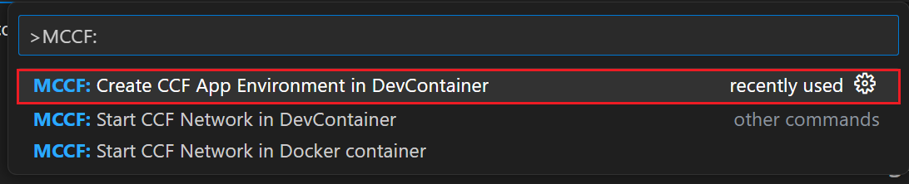

# MCCF VSCode Extension

We created a Visual Studio Code extension for [Managed CCF](https://techcommunity.microsoft.com/t5/azure-confidential-computing/microsoft-introduces-preview-of-azure-managed-confidential/ba-p/3648986) users to simplify and enhance their development experience. With this extension, users can seamlessly create, test, manage, and deploy their CCF applications directly within Visual Studio Code. By eliminating the need for external tools and [documentation]((https://microsoft.github.io/CCF/main/build_apps/get_started.html)), we streamline the workflow, making it faster and more efficient for Managed CCF customers.

One important aspect of the extension is providing a local sandbox, which offers users a self-contained development environment with all the necessary dependencies for developing applications locally. Additionally, we will incorporate templating, allowing users to quickly create and build CCF applications in JavaScript. Lastly, we aim to streamline the process of testing and deploying CCF applications to Managed CCF instances in Azure.

## Create your CCF Application
1. To start your project, first set up the self-contained development environment

 

 2. Next, select the template you would like to begin building your project from. You can choose from 3 different options, a generic template, a sample banking app, or a custom project given you have the github repository link

 

3. After choosing your template, the application will open in a development container with all of the necessary dependencies where the app will be ready for network initialization

> The feature allows users to run and build CCF app in its development container with ease. Users are able to choose between already existing CCF apps' templates that already have the files and dependencies installed.

## Start a CCF Network

Activate a network with one node and member to start a network all from docker or the devcontainer. The option is left to users as it allows non-devconatiner users to start a CCF  network on their local environment. 

### Start Network in DevContainer
1. Upon starting the network in a DevContainer, you will be given the option to choose a project folder. Make sure that you are in the root folder of your project workspace (for example workspace/ccf-app-template). 
2. You should see the following output generating in the terminal. This is how you will know your network has been successfully set up:
``` bash
[22:07:02.315] Virtual mode enabled
[22:07:02.316] Starting 1 CCF node...
[22:07:06.167] Started CCF network with the following nodes:
[22:07:06.168]   Node [0] = https://127.0.0.1:8000
[22:07:06.168] You can now issue business transactions to the libjs_generic application
[22:07:06.168] Loaded JS application: /workspaces/ccf-app-template/dist/
[22:07:06.168] Keys and certificates have been copied to the common folder: /workspaces/ccf-app-template/workspace/sandbox_common
[22:07:06.168] See https://microsoft.github.io/CCF/main/use_apps/issue_commands.html for more information
[22:07:06.168] Press Ctrl+C to shutdown the network
```

### Start Network in Docker Container
1. To build a runtime image of the JavaScript application via docker, yo will get the option to "Select Dockerfile." Select the path /workspaces/{your-chosen-template}/docker/ccf_app_js.virtual.
2. When choosing project folder, ensure that you are in the root folder of your project workspace (for example workspace/ccf-app-template).

## Submit Application Proposal
[insert text here]
### Usage
There are reasons that users want to use this extension for securing blockchain networks and banking consortium 
- Customers can provide CCF application while the extension hosts CCF nodes and manages it for them and runs inside an **enclave**.

- Enables users to build **confidential multi-party applications** with **customizable governance** and **auditability**.


## Lifecycle

The MCCF VScode extension follows the [Modern Lifecycle](https://learn.microsoft.com/en-us/lifecycle/policies/modern). Follow the instructions [here](https://code.visualstudio.com/docs/editor/extension-marketplace) to get the latest updates of the extension.


### Related Information 

 Visit <https://ccf.microsoft.com/> for more information about CCF apps and MCCF 
