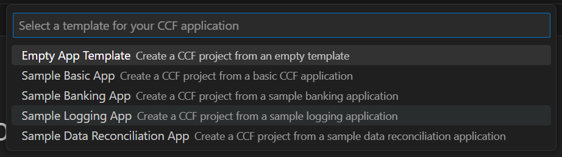

# MCCF VSCode Extension

The current workflow for Managed CCF users involves the development and testing of their own CCF applications using the [available CCF documentation and tools.](https://microsoft.github.io/CCF/main/build_apps/get_started.html) 

To enhance the developer experience for Managed CCF customers, we have  developed a dedicated Visual Studio Code extension that aims to empower developers by providing a comprehensive set of features for local CCF application development and seamless deployment to Azure as Managed CCF instances.

## Create your CCF Application
1. To start your project, first set up the self-contained development environment and choose the template you'd like to use

> The feature allows users to run and build CCF app in its development container with ease. Users are able to choose between already existing CCF apps' templates that already have the files and dependencies installed.

## Start your Network
1. To initialize your CCF network
\
\
\

**START A  CCF NETWORK**

Activate a network with more than one node and member to start a [network goverance](https://microsoft.github.io/CCF/main/governance/open_network.html#adding-users), create and submit an [add users proposal](https://microsoft.github.io/CCF/main/governance/open_network.html#adding-users) which [opens the network](https://microsoft.github.io/CCF/main/governance/open_network.html#opening-the-network) for users all from docker or the devcontainer. The option is left to users as it allows non-devconatiner users to start a CCF  network on their local environment.

## 2. Roadmap
1. To build your CCF app,press F5 

2. Type "**MCCF...**" the following prompts will appear
     

3. Choose "**Create CCF App Environment**"  to use the distinctive templates provided

4. To work with a generic app template select "**Standard Template**" or to use a custom template such as the banking app select "**Custom Template**". The following templates should appear for your choosing.
    

5. Click on "**Start CCF Network**" to start up your environment and begin a network goverance

6. For non-devcontainer users click "**Start CCF Network with Docker**".

### Usage
There are reasons that users want to use this extension for securing blockchain networks and banking consortium 
- Customers can provide CCF application while the extension hosts CCF nodes and manages it for them and runs inside an **enclave**.

- Enables users to build **confidential multi-party applications** with **customizable governance** and **auditability**.

## Lifecycle

The MCCF VScode extension follows the [Modern Lifecycle](https://learn.microsoft.com/en-us/lifecycle/policies/modern). Follow the instructions [here](https://code.visualstudio.com/docs/editor/extension-marketplace) to get the latest updates of the extension.

### Related Information 

 Visit <https://ccf.microsoft.com/> for more information about CCF apps and MCCF 
