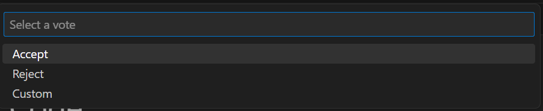

# Visual Studio Code extension for Managed CCF

[](https://msazure.visualstudio.com/One/_build/latest?definitionId=326742&repoName=mccf-vscode-extension&branchName=main)

This Visual Studio Code extension for [Managed CCF](https://techcommunity.microsoft.com/t5/azure-confidential-computing/microsoft-introduces-preview-of-azure-managed-confidential/ba-p/3648986) simplifies and enhances the development experience. With this extension, users can seamlessly create, test, manage, and deploy their CCF applications directly within Visual Studio Code. By eliminating the need for external tools and [documentation](https://microsoft.github.io/CCF/main/build_apps/get_started.html), user workflow is faster and more efficient for Managed CCF customers.

Use MCCF functions to quickly create the development environment with all necessary dependencies with templates, and easily test and deploy CCF applications to Managed CCF instances in Azure. All of these features combined enable users to build **confidential multi-party applications** with **customizable governance** and **auditability**.

## Create your CCF Application

1. To start your project, first set up the self-contained development environment


2.  Next, select the template you would like to begin building your project from. You can choose from 5 different options: 

-  The empty app template provides a template with no code for users to start from scratch.

-  The banking app template provides a bank system that, **ONLY** allows members to deposit money, check their account balance, and transfer money,  can be run by multiple banks in a consortium.

- The basic app template serves as a generic template that is used to build the CCF app locally. It has the general steps to set up and interact with the CCF network using a Linux environment

- The data reconciliation app template is a sample application that allows members to submit their data for reconciliation and query for reconciliation results. 

- The logging app template is leveraged by users to utilize a secure auditable logging system where only authorized users can access, log, and track activities.


3. After choosing your template, users are prompted to choose the destination folder where the application opens in a development container, with all necessary dependencies, ready for network initialization.

   > The feature allows users to run and build the CCF app in its development container with ease. Users can choose between already existing CCF apps' templates that already have the files and dependencies installed. 


All templates provide governance in CCF which is implemented as a constitution. The constitution set the rules and procedures for validating, resolving, and applying the proposals within a CCF network. Any member can submit a proposal in which other members can vote for or against (ballot) the actions they want to be executed.


## Start a CCF Network

Activate a network with one node and member to start a network all from docker **OR** the development container. The option is left to users as it allows non-development container users to start a CCF network on their local environment.


- ### START NETWORK IN A DEVELOPMENT CONTAINER

1. Upon starting the network in a DevContainer, you will be given the option to choose a project folder. Make sure that you are in the root folder of your project workspace (for example workspace/ccf-app-template)

2. You should see something similar to the following output generating in the terminal. This is how you will know your network has been successfully set up:
```bash
[22:07:02.315] Virtual mode enabled
[22:07:02.316] Starting 1 CCF node...
[22:07:06.167] Started CCF network with the following nodes:
[22:07:06.168]   Node [0] = https://127.0.0.1:8000
[22:07:06.168] You can now issue business transactions to the libjs_generic application
[22:07:06.168] Loaded JS application: /workspaces/ccf-app-template/dist/
[22:07:06.168] Keys and certificates have been copied to the common folder: /workspaces/ccf-app-template/workspace/sandbox_common
[22:07:06.168] See https://microsoft.github.io/CCF/main/use_apps/issue_commands.html for more information
[22:07:06.168] Press Ctrl+C to shutdown the network
```

- ### START NETWORK IN A DOCKER CONTAINER 
1. To build a runtime image of the JavaScript application via docker, you will get the option to "Select Dockerfile." Select the file in the path: /workspaces/{your-chosen-template}/docker/ccf_app_js.virtual


2. When choosing a project folder, ensure that you are in the root folder of your project workspace:

After starting the network in a Docker Container, your output should look similar to the following :


> TIP: Always double-check your current directory selection. If you're not in the right place, these commands may not execute as expected.

## Test operator actions

An operator is a member in a Managed CCF resource that is allowed to perform a limited set of actions. The operator is responsible for performing regular maintenance activities like renewing the service and node certificates periodically, submitting the recovery share during a DR and adding and removing nodes in the network. The operator is essential for the successful operation of a network. The constitution lists the set of actions that an operator is allowed to do in a network. 

A custom constitution might prevent the operator from running one or more operations in a Managed CCF network. To prevent it, a few tests are run on a local CCF network created with the custom constitution. If the tests pass, it confirms that the custom constitution supports operator actions. 

1. Start a 1 node CCF network in a dev container by selecting the 'MCCF: Start CCF Network in Devcontainer' command. 

2. Run the command 'MCCF: Test operator actions on custom constitution' to start the tests. The command requires the member certificate and key to sign the proposals. The member certificate and key is generated in step # 1 and located in the /workspace/sandbox_command directory.

The result of the tests indicates if the operator actions are allowed in the custom constitution. A failure indicates that the custom constitution in incompatible with the operator actions and must be investigated. 

## Adding New  Members or Users

- ### GENERATE MEMBER IDENTITY 
  The Generate Identity Keys creates all of the certificates necessary to add members and users to an MCCF network and ensures that all IDs are unique. After entering a unique key identifying name, the user will be prompted to select the folder where they would like to store their keys within the file system.

1. Select "Generate Identity Keys" 


2. Enter the ID for a member/user


3.  The output should look similar to this : 


- ### GENERATE USER PROPOSAL 
  The generated user proposal allows the developer to easily generate user proposals for users they would like to add to the network. The user will choose the specific user's signing certificate and the folder in which they would like to store the proposal within their project or computer.

1. Select "Generate user proposal" 


2. A user proposal JSON file should generate right away


- ### GENERATE MEMBER PROPOSAL
  The generate member proposal allows for the developer to easily generate member proposals for members they would like to add to the network to govern. The user will choose the specific member's signing certificate and the folder in which they'd like to store the proposal in within proposal.

1. Select "Generate member proposal" 


2. A member proposal JSON file should generate right away

 > Signing certificate refers to name_cert.pem while signing key refers to name_privk.pem

## Proposing and Voting for a Proposal

- ### SUBMIT A PROPOSAL
1. To submit a proposal you would need to provide four parameters which are the network URL, signing key, certificate key, and the proposal file. Choose the correct file format as the signing and certificate keys are **PEM** files while proposals are **JSON** files.


2. Here, the newwork URL refers to the URL of the CCF app currently running. If you are following this README, it would be the URL created in the second step [start network](#start-network-in-a-development-container) when starting a network in a development container or a docket container (the default value for this is https://127.0.0.1:8000).

3. The certificate and key used here must be those of a member that is already registered in the node to pass validation. Before adding any member initially, we must use the cert and key information of the starting node's member. The relevant data for the starting node member is set by default in `~/workspace/sandbox_common` (or the path shown in console `Keys and certificates have been copied to the common folder` when starting the network in the second step: [start network](#start-network-in-a-development-container)). For example, in Node [0], you can use `member0_cert.pem` and `member0_privk.pem` for the initial vote.

4. Once provided a new proposal can be submitted. Additional members can vote on the proposal using a proposal ID.


- ### VOTE ON A PROPOSAL  
This feature allows the developer to easily vote on a proposal to add a user to a network via the certificate/key of the member(s) of the network. The certificate and signing keys are the authorization member's certificates.

1. Enter the network URL and select a ballot.


2. Select a vote.


> The custom option allows users to choose their specific ballot from their files.

## MCCF Instance
- ### Create an MCCF Instance
Users can create instances based on their specific preferences which require their specific subscription key. In addition, users can review all of their current instances that are currently running on their Azure account.

1. Activate the specific command and select the signing certificate of your choice which could be pre-generated or created using the key-generator script located in the extension command.

2. Name the identifier for the instance, along with a name, location of deployment (specific Azure subscription, and resource group), and the node count.

3. After this information has been entered, your output will show the progress of creating the instance displaying its status. Your output should look similar to the following output:


- ### LIST AN MCCF Instance
1. Select the specific subscription ID connected to your account.

2. Select the specific resource group which allows the extension to display various instances in that resource group and their specified details.


3. Select any instance of your choosing


- ### Delete an MCCF Instance
Users can delete an instance with the given subscription id and resource group on their Azure account.
1. Select the specific subscription ID connected to your account.

2. Select the specific resource group.

3. After the required fields have been provided, your output will show the progress of deleting the instance displaying its status. Your output should look similar to the following output:


## Creating an Application Bundle

The application bundle allows the user to bundle all of their application dependencies, code, and other essential files to deploy their application in any environment that is needed, along with the proposal to allow the app to be deployed on a CCF instance/network.