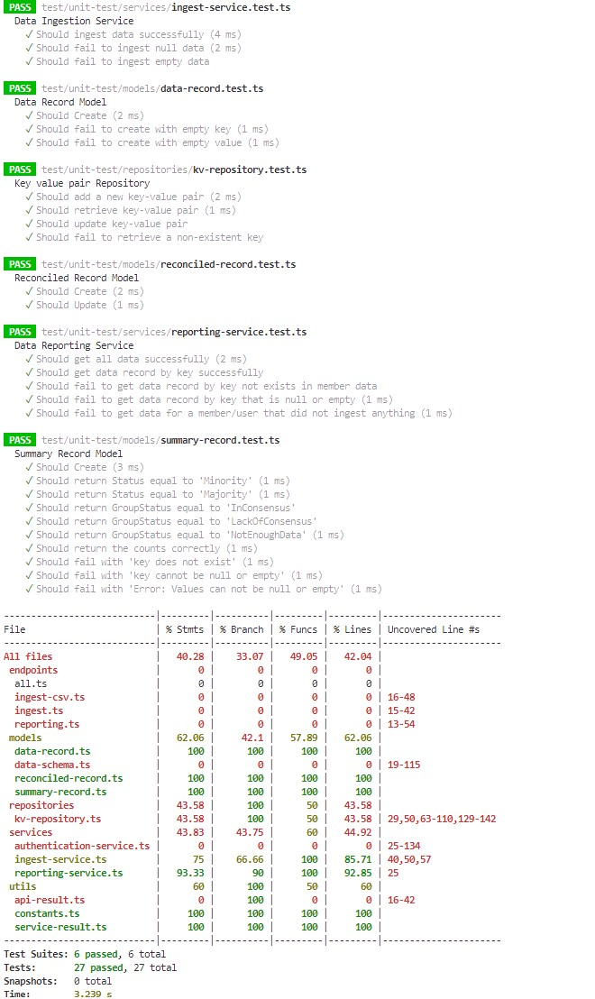

# Testing Strategy

## Overview

The purpose of this document is to describe how the application is being tested to assure quality and coverage.

The application testing strategy depends on two main types of testing to achieve the objective:
- Unit testing
- End to end (e2e) testing


## Unit testing

This type of testing covers the application business logic (domain models and services) and generates a test result and code coverage report that give an insight on how the application codebase is covered by the defined test cases.

The application is using the [`Jest Testing Framework`](https://jestjs.io/docs/getting-started) to define the unit-test scenarios in addition to generating a visual view and developer friendly for testing results and code coverage.



### How to run unit tests

To run the application unit tests

```bash
# In the terminal window
make unit-test                 # Build and run unit-test using jest framework
```

**NOTE**: To enable the CCF functionality on testing environment, the application is using built-in feature of CCF, [the Polyfill implementation](https://microsoft.github.io/CCF/main/js/ccf-app/modules/polyfill.html) which overrides the CCF modules' implementation to support testing and local environments

## End to end testing

End to end testing (E2E testing) is a testing method that involves testing an application’s workflow from beginning to end. This method aims to replicate real user scenarios to validate the system for integration and data integrity.

The application uses bash scripts to start up the network environment a typescript application to perform end-to-end testing for the Data Reconciliation endpoints.

There are 3 different types of network this sample can be tested against:
- Sandbox (virtual)
- Docker (virtual - enclave)
- Azure Managed CCF (enclave)


The test script [./test.sh](./test.sh) contains the call to the TypeScript application located in [e2e-test folder](./e2e-test/src). This code runs the test scenarios and result validation for each endpoint. Additionally, there are assertions at the end of the test to compare report results with expected values. All requests are made simulating MTLS members' signatures via certificates and private keys.


**Note:** _The test script of each sample is called by wrapper scripts that exist in the [scripts](scripts/) folder. 
These wrapper scripts are used for all samples, and they are responsible for starting the particular network with the correct constitution and setting up governance (users, members, and applications). The wrapper scripts will also close the network after the tests have finished (excluding mCCF)._


### How to run e2e-test

To run the application e2e tests

```bash
# In the terminal window
make test                      # Run end-to-end(e2e) tests in a sandbox (virtual) environment
```

|   Network   |     Command                |                  Script                       | Supported environment     |
| :---------  | :------------------------- | :-------------------------------------------  | :------------------------ |
| Sandbox     | `make test`                | [test_sandbox](scripts/test_sandbox.sh) | virtual                   |
| Docker      | `make test-docker-virtual` | [test_docker](scripts/test_docker.sh)   | virtual                   |
| Docker      | `make test-docker-enclave` | [test_docker](scripts/test_docker.sh)   | enclave (TEE)             |
| Managed CCF | `make test-mccf`           | [test_mccf](scripts/test_mccf.sh)     | enclave (TEE)             |


**To Run the application's e2e-tests using docker on enclave environment**
  - First, create a Virtual Machine with TEE hardware. Please follow [here](https://github.com/microsoft/CCF/blob/main/getting_started/azure_vm/README.md)
  - Clone the samples repository on the created VM
  - Run the `make test-docker-enclave`

**To Run the application's e2e-tests on a Managed CCF**
  - First, create a Managed CCF instance on your Azure subscription. Please follow [here](https://github.com/microsoft/ccf-app-samples/tree/main/deploy#deploying-the-ccf-samples)
  - Run the e2e-test, please follow [here](https://github.com/microsoft/ccf-app-samples/tree/main/deploy#deploying-a-ccf-application-to-azure-managed-ccf)
